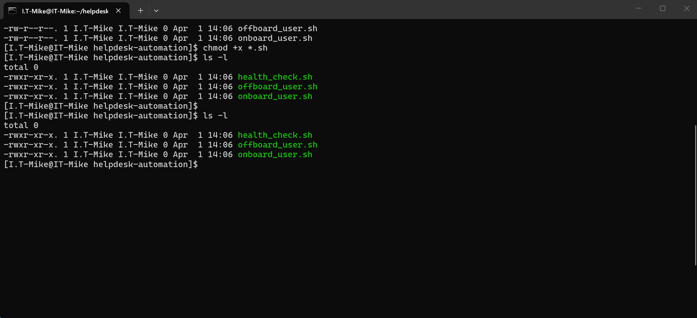
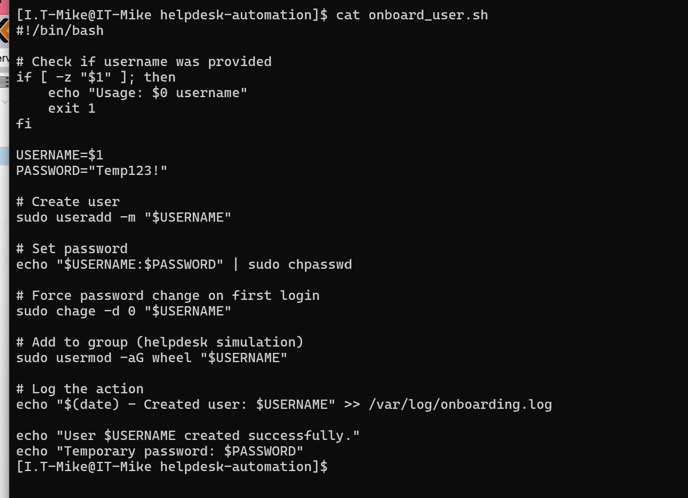
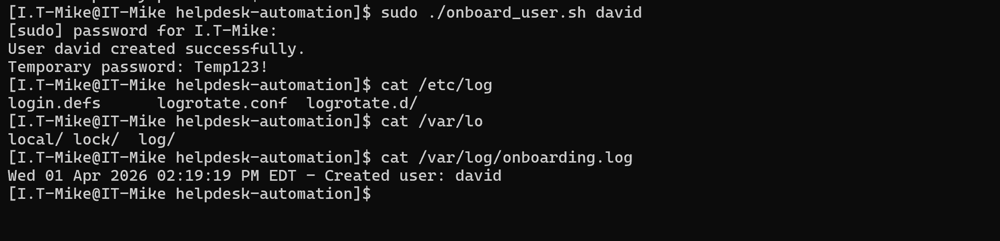
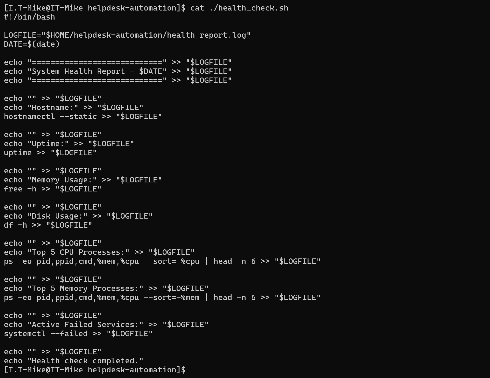
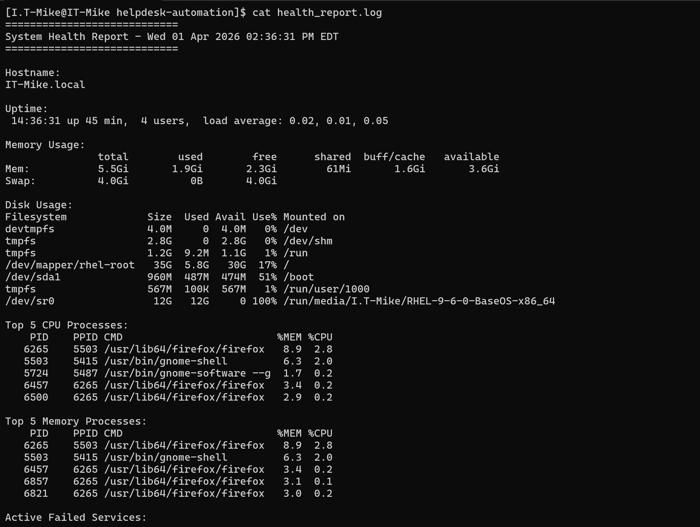
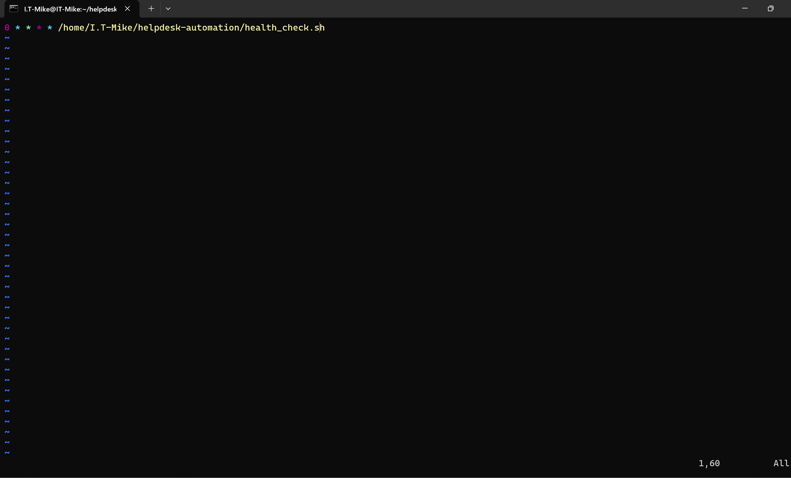
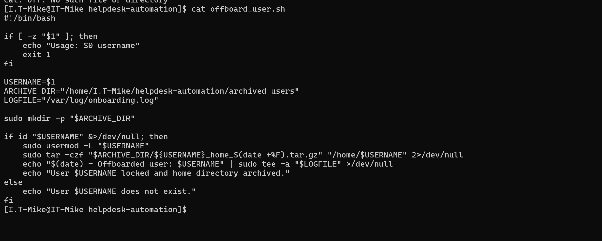
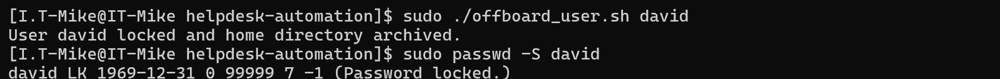

# helpdesk-automation
A beginner-friendly RHEL helpdesk automation project using Bash scripting

# RHEL Helpdesk Automation Toolkit

## Overview
This project was built to simulate common tasks performed in a real IT helpdesk environment using Red Hat Enterprise Linux (RHEL).

The goal was to move beyond theory and practice real system administration tasks directly from the command line. The scripts automate repetitive helpdesk responsibilities such as creating users, disabling accounts, and checking system health.

This project was completed in a personal homelab running RHEL on Proxmox.

---

## What This Project Does

### User Onboarding
The onboarding script creates a new user account and prepares it for first-time use.

It:
- Creates a user with a home directory
- Assigns the user to appropriate groups
- Sets a temporary password
- Forces a password reset on first login
- Logs the action for tracking

This simulates what a helpdesk technician would do when setting up a new employee account.

---

### User Offboarding
The offboarding script handles account cleanup when a user no longer needs access.

It:
- Locks the user account to prevent login
- Archives the user’s home directory
- Logs the offboarding action

This reflects real-world processes used when employees leave an organization or change roles.

---

### System Health Monitoring
The health check script collects important system information and writes it to a log file.

It checks:
- System uptime
- Memory usage
- Disk usage
- Top CPU and memory-consuming processes
- Failed system services

This type of monitoring is useful for troubleshooting and maintaining system stability.

---

## Technologies Used
- Red Hat Enterprise Linux (RHEL 9)
- Bash scripting
- Linux system tools (useradd, usermod, chage, systemctl)
- Proxmox (for virtualization)

---

---

## What I Learned
Working on this project helped me improve my understanding of:

- Managing Linux users and permissions
- Automating tasks using Bash scripting
- Monitoring system performance and services
- Working with logs for troubleshooting
- Navigating and managing a Linux system entirely from the terminal

---

## Future Improvements
- Add alerting for high CPU or disk usage
- Improve logging format and error handling
- Add a menu-based interface for easier interaction
- Integrate scheduling (cron) for automated health checks

---

## Screenshots

### Hostname Setup

### Script Permissions

### User Onboarding

### Onboarding Verification

### Health Check Script

### Health Check Output

### Cron Job Setup

### Cron Verification

### Offboarding Script

### Offboarding Verification

---

## Author
Michael Gilles
